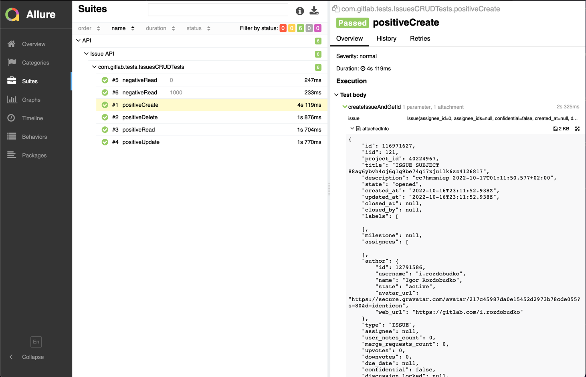

# ABN AMRO Test Assignment

This project contains automation tests for Issue API of gitlab.

### Prerequisites

The following things must be installed:
1. Java (1.8)
2. Maven (3.3)
3. Git

### Installing
1. Clone the project
2. Navigate to the root directory of the project

## Running the tests
Run Tests via terminal: `mvn clean install`

### Getting test report

Generate and open report: `mvn allure:serve`. This will open report in browser.

## Built With

* [Maven](https://maven.apache.org/) - Dependency Management
* [Rest-Assured](https://rest-assured.io/) - Testing and validating REST services in Java

## Author

* **Igor Rozdobudko**

## Allure Test Result

